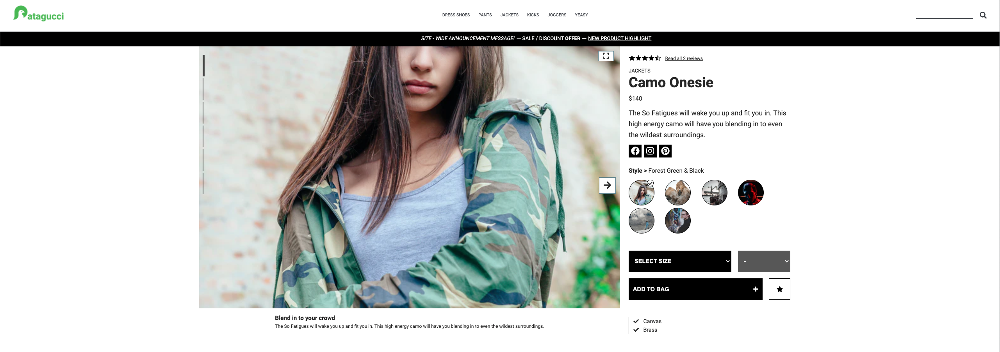
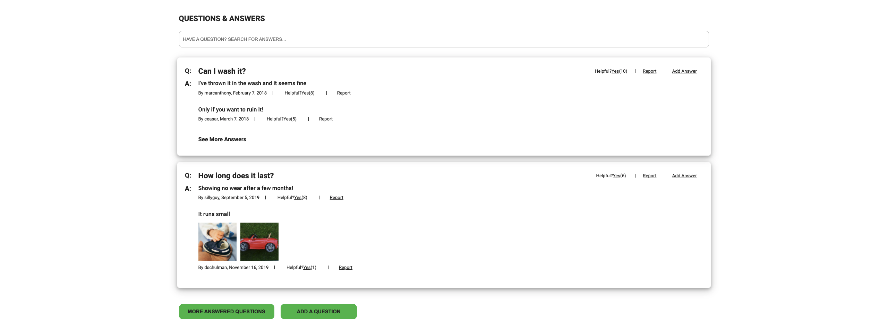
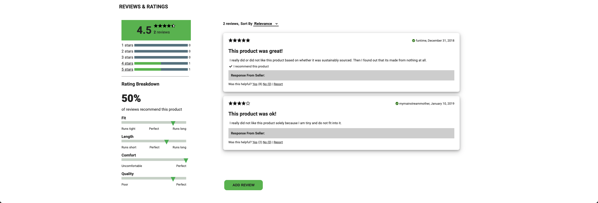

[](https://shields.io/)
[](https://shields.io/)
[](https://shields.io/)

# Patagucci

Patagucci is an E-commerce website with four modules (Product Details, Related Products, Questions & Answers, Reviews)

## Screen Shot
### Product Details


### Related Products


### Questions & Answers


### Reviews



## Installation

Make a copy of config_test.env and rename to config.env

API_KEY={ YOUR API KEY }

API_URL=https://app-hrsei-api.herokuapp.com/api/fec2/hr-sfo

Use the package manager [npm](https://www.npmjs.com/get-npm) to install Patagucci.

```bash
npm install
npm run build
npm run start
```


## Features
- Product Details
  - Images slider
  - Add to shopping cart
  - Add to favorite
  - Select size
- Related Products
  - Add to favorite
  - Images carousel
- Questions & Answers
  - Add/Report question or answer
  - Image modal
  - Search question or answer
  - Upvote question or answer
- Reviews
  - Add/Report review
  - Sorting
  - Rating breakdown

## Authors
| Name                | Github                            |Responsibilities |
| --------------------|:------------------------------:   |------:|
| Michael Elliott     |https://github.com/melliottgithub  |Fullstack Engineer (Product Details)|
| Shay Rosner         |https://github.com/Smrosner        |Frontend Engineer (Related Products)  |
| Kevin Liu           |https://github.com/kevinalexliu    |Fullstack Engineer (Questions & Answers)|
| Jack Zhen           |https://github.com/jackzhen1996    |Fullstack Engineer (Reviews)|